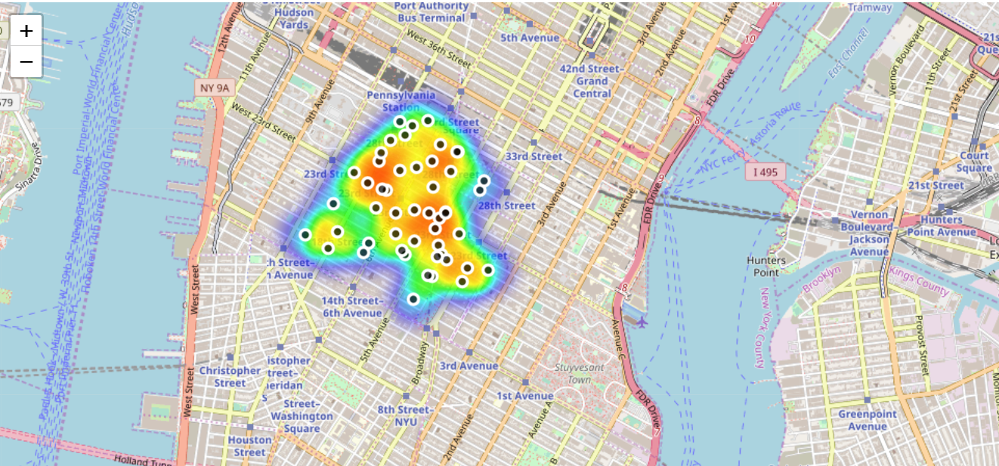

# Coursera-Capstone-Project
Coursera Data Science Capstone Project

# Table of Contents:
1. Week 3: Segmenting and Clustering Neighborhoods in Toronto
2. Week 4: Capstone Project - The Battle of Neighborhoods (Pt_1)
3. Week 5: Capstone Project - The Battle of Neighborhoods (Pt_2)

# Week 4: Capstone Project - Exploring Coffee Shops in New York City

